<!DOCTYPE html>
<html>
<head>
</head>
<link rel="stylesheet" type="text/css" href="style.css">
<body>
<h1>Administración Fichas de consultorio móvil</h1>
<h2>Cómo compilar/ejecutar</h2>

Para poder utilizar el código necesitamos descargar ya sea la carpeta o un archivo en específico. Para poder descargar la carpeta se hacen los siguientes pasos:

<ol>
	<li>En el proyecto de Github por defecto muestra la rama main del proyecto lo único que se debe de hacer es cambiar a la rama master para poder visualizar todos los archivos pertenecientes al proyecto.</li>
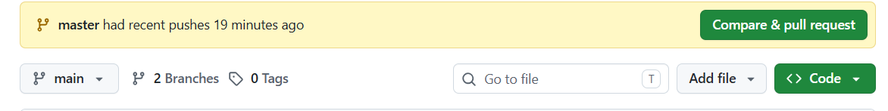
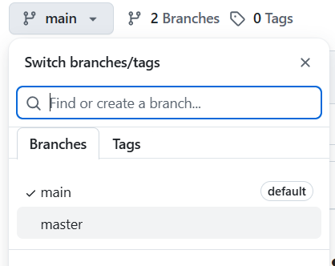
<li>Seleccionamos master para poder visualizar los códigos</li>
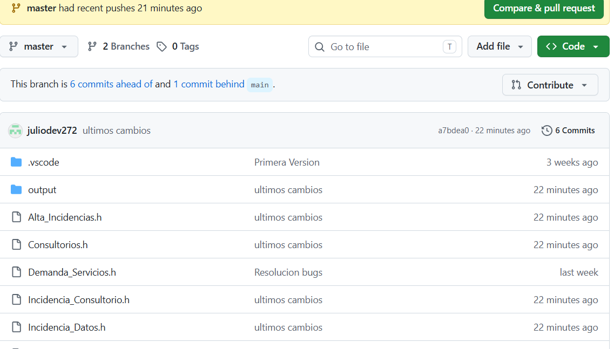
<li>En el proyecto de GitHub nos vamos al apartado de Code que se encuentra en la parte superior derecha del proyecto.</li>
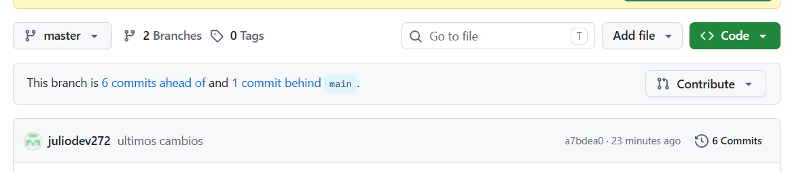
<li>En el apartado de Local, seleccionamos la opción Download ZIP para descargar la carpeta completa.</li>
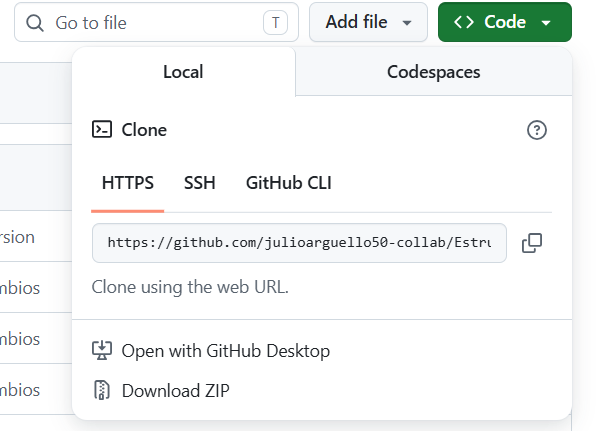
<li>Si queremos compartir el repositorio solo copiamos la url que proporciona Github</li>
<li>Una vez descargado el proyecto nos dirigimos a la aplicación de archivos de nuestra computadora y lo buscamos para poder descomprimirlo.
</li>
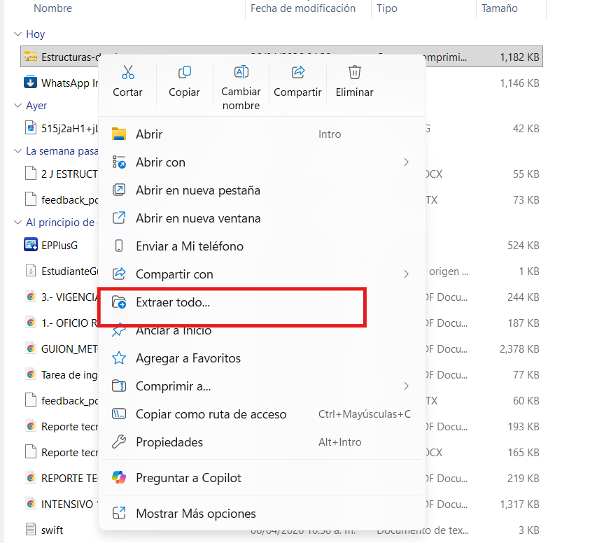
<li>Damos clic en extraer</li>
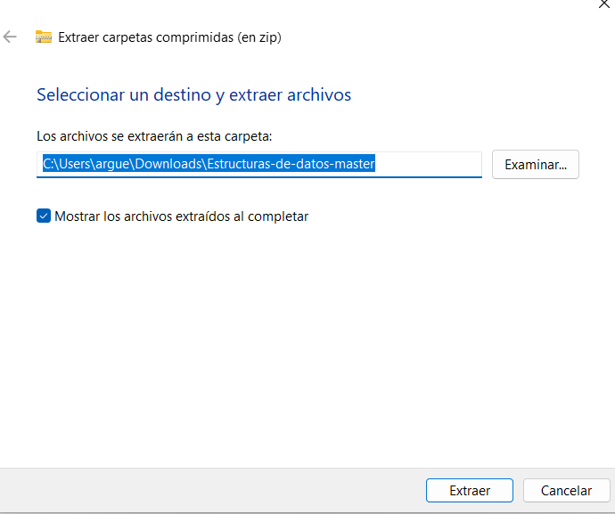
</ol>

Ya tenemos la carpeta completamente ahora necesitamos de un Ide (Entorno de desarrollo integrado) para poder utilizar nuestros programas.
Una vez descargada la carpeta necesitamos un IDE (Entorno de Desarrollo Integrado) para poder ejecutar el código que en este caso está hecho en el lenguaje C.
Los IDE más populares para ejecutar código C son los siguientes:

<ul>
  <li>Visual Studio Code (VS Code) </li>
  <li>Visual Studio</li>
  <li>Dev-C++</li>
</ul>

También existen compiladores en línea que pueden ejecutar código C, algunos ejemplos son:

<ul>
  <li>GDB Online Debugger</li>
  <li>myCompiler</li>
  <li>OneCompiler</li>
  <li>Programmiz</li>
</ul>

Pero no son recomendados para proyetos grandes ya que los compiladores en línea carecen de ciertas características que pueden impedir ejecutar el código.
Para esta ocasión se usará Visual Studio Code ya que es el más popular para ejecutar código C.

<h2>Como ejecutar codigo C en vscode</h2>

Para poder ejecutar nuestro proyecto es importante que la computadora que se utilice para compilar tenga el compilador de C ya que sin este el código no podrá ser ejecutado por Vs code para esto tenemos que entrar a la terminal de la computadora.

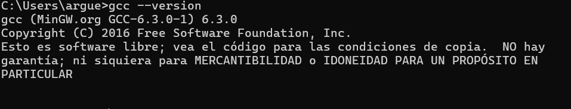

Para windows se utiliza la tecla windows + r Para mac con el atajo de teclado ⌘ + Espacio, escribir "Terminal" y presionar Enter. se ejecuta el comando gcc -version. Si no aparece la version es porque no tienes el compilador si es asi en el siguiente enlace es para un video en youtube para poder instalar el compilador Instalar el compilador de para C/C++
Una vez hecho esto basta con abrir la carpeta previamente descargada denominada <strong>AdministracionFichas</strong> y abrir el archivo <strong>main.C</strong> Después en el editor de código para compilar nos iremos a la parte superior derecha y daremos clic en el triángulo para poder compilar y ejecutar el código.

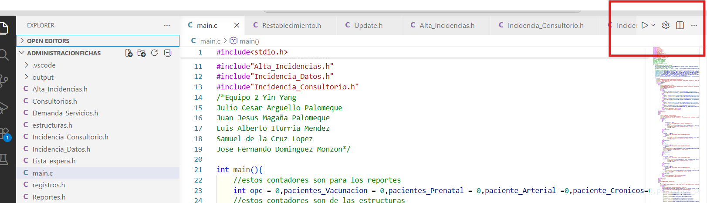

Finalmente, se podrá visualizar el programa ya compilado para poder ser usado.

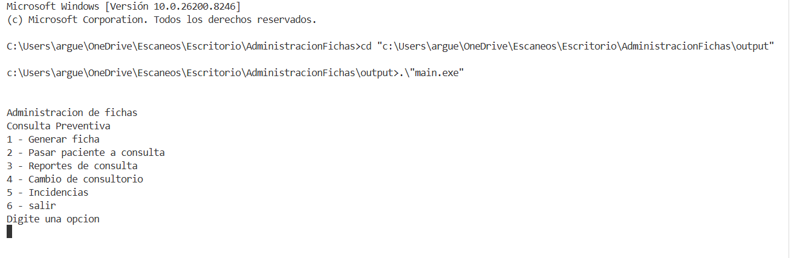

A continuación, se presentan las variables que se utilizaron en la creación del programa. En este proyecto se utilizaron variables de dos tipos. Enteros y de estructura, cada uno de estos tiene un propósito distinto mismo que se presenta a continuación. Las variables de tipo entero se declararon dentro del main ya que son necesarias para el programa ya que para esta ocasión se utilizarán a través de punteros para poder manejarlos desde la memoria, además de que estas mismas variables se utilizarán en funciones que estarán en otros archivos por lo cual es importante manejarlos como punteros para así acceder a su valor más fácil. Las variables de tipo estructura son variables que permiten guardar varios datos diferentes dentro de una sola unidad al igual que con las enteras usaremos el concepto de memoria dinámica para poder utilizarlas en otras funciones que están hechas en otros archivos.

<table border = 1>
	<h2>Variable de tipo entero</h2>

Las variables de tipo entero son aquellas que guardan números enteros exclusivamente, no se pueden guardar números decimales ni caracteres, solo números enteros además estos datos enteros se guardan en un espacio de 4 bytes que son asignados por la computadora permitiendo acceder al valor exacto que ese espacio almacena con el concepto punteros.

<tr>
<td>
Opcion:
</td>
<td>Es la primera variable en utilizarse ya que se utiliza para guarda la opción que el usuario elija dentro del menu principal del programa</td>
</tr>
<tr>
<td>
opcion_GenerandoFicha:
</td>
<td>Esta variable es utilizada para poder acceder a las 6 posibles opciones del menu Generando Ficha.</td>
</tr>
<tr>
<td>
opcion_ListaConsulta
</td>
<td>Esta variable se utiliza para poder acceder a las 6 posibles opciones del menu Gestión de consultas.</td>
</tr>
<tr>
<td>
opcion_ReportesConsulta
</td>
<td>Esta variable se utiliza para poder acceder a las 4 posibles opciones del menu Reportes de consulta</td>
</tr>
<tr>
<td>
opcion_ListaEspera
</td>
<td>Esta variable se utiliza para poder acceder a las 6 posibles opciones del menu listas de espera.</td>
</tr>
<tr>
<td>
resp_gestionConsulta
</td>
<td>Esta variable se utiliza para poder acceder a las posibles respuestas de confirmación en el momento de pasar a un paciente a consulta.</td>
</tr>
<tr>
<td>
resp_CambioConsultorio
</td>
<td>Esta variable se utiliza para poder acceder a las 6 posibles opciones del menu cambio de consultorio de última hora.</td>
</tr>
<tr>
<td>
opcion_Incidencias
</td>
<td>Esta variable se utiliza para poder acceder a las 6 posibles opciones del menu incidencias.</td>
</tr>
</table>
<h1>Contadores</h1>
<table border=1>
	<tr>
<td>
encontrado
</td>
<td>Esta variable se utiliza para determinar si se atendieron pacientes en los consultorios, si esta variable cuenta con el valor cero significa que no se atendió a ningún paciente en el dia.</td>
</tr>
<tr>
<td>
No_lista
</td>
<td>Esta variable se utiliza para enlistar a los pacientes atendidos en el historial del consultorio, esta variable no define el número de ficha solo se encarga de dar un numero de lista dentro del historial.</td>
</tr>
<tr>
<td>
buscar_ficha
</td>
<td>Esta variable se utiliza para guardar el número de ficha a buscar a la hora de declarar las incidencias.</td>
</tr>
<tr>
<td>
contador_incidencias
</td>
<td>Esta variable se utiliza para contar la cantidad de veces que se declaró una incidencia dentro del historial de incidencias con el fin de saber cuántas incidencias ocurrieron en el día.</td>
</tr>
<tr>
<td>
pacientes_vacunacion
</td>
<td>Esta variable tiene el fin de contar cuantos pacientes fueron atendidos en el consultorio de vacunación.</td>
</tr>
<tr>
<td>
pacientes_prenatal
</td>
<td>Esta variable tiene el fin de contar cuantos pacientes fueron atendidos en el consultorio de control prenatal.</td>
</tr>
<tr>
<td>
paciente_Arterial
</td>
<td>Esta variable tiene el fin de contar cuantos pacientes fueron atendidos en el consultorio de presión arterial.</td>
</tr>
<tr>
<td>
paciente_Cronicos
</td>
<td>Esta variable tiene el fin de contar cuantos pacientes fueron atendidos en el consultorio de enfermedades crónicas.</td>
</tr>
<tr>
<td>
paciente_OtroServicio
</td>
<td>Esta variable tiene el fin de contar cuantos pacientes fueron atendidos en el consultorio de otros servicios.</td>
</tr>
<tr>
<td>
num_V
</td>
<td>Esta variable se utiliza para asignar el número de ficha al paciente del consultorio vacunación la cual funciona como un contador ya que cada que le asigna un numero al número de ficha esta ira aumentando para no repetir ficha con el próximo paciente.</td>
</tr>
<tr>
<td>
num_P
</td>
<td>Esta variable se utiliza para asignar el número de ficha al paciente del consultorio de control prenatal la cual funciona como un contador ya que cada que le asigna un numero al número de ficha esta ira aumentando para no repetir ficha con el próximo paciente.</td>
</tr>
<tr>
<td>
num_PA
</td>
<td>Esta variable se utiliza para asignar el número de ficha al paciente del consultorio de presión arterial la cual funciona como un contador ya que cada que le asigna un numero al número de ficha esta ira aumentando para no repetir ficha con el próximo paciente.</td>
</tr>
<tr>
<td>
num_EC
</td>
<td>Esta variable se utiliza para asignar el número de ficha al paciente del consultorio de enfermedades cronicas la cual funciona como un contador ya que cada que le asigna un numero al número de ficha esta ira aumentando para no repetir ficha con el próximo paciente.</td>
</tr>
<tr>
<td>
num_OS
</td>
<td>Esta variable se utiliza para asignar el número de ficha al paciente del consultorio de otros servicios la cual funciona como un contador ya que cada que le asigna un numero al número de ficha esta ira aumentando para no repetir ficha con el próximo paciente.</td>
</tr>
</table>
<h1>Variables de tipo de estructura</h1>

Las variables de tipo estructura en C son variables que permiten guardar varios datos diferentes dentro de una sola unidad. Sirve para agrupar las características de una persona que en nuestro caso sería un paciente, dentro de una estructura que los relaciona.

Primero vamos a describir las variables que son comunes en los registros de ficha de cada tipo de consultorio que son las que se encargan de describir al paciente.

<table border=1>
	<tr>
	<td>
nombre
</td>
<td>Esta variable es de tipo char con un espacio de 50 caracteres el cual sirve para guardar el nombre del paciente sin los apellidos</td>
</tr>
<tr>
<td>
apellidos
</td>
<td>Esta variable es de tipo char con un espacio de 50 caracteres el cual sirve para guardar los apellidos del paciente esto con el fin de llevar un mejor control sobre los datos del paciente.</td>
</tr>
<tr>
<td>
edad
</td>
<td>Esta variable de tipo entero guarda la edad del paciente</td>
</tr>
<tr>
<td>
no_ficha
</td>
<td>Esta variable de tipo entero guarda el número que se le asignara para determinar que numero de ficha es, ejemplos como 2, 4, 6, etc.</td>
</tr>
<tr>
<td>
atendido
</td>
<td>Esta variable de tipo entero se encarga de determinar si el paciente ya fue atendido o no usando solo 0 para no atendido y 1 para atendido.</td>
</tr>
<tr>
<td>
sig
</td>
<td>Esta variable se utiliza para avanzar dentro de los nodos y poder conectarlos a manera de listas, colas o pilas.</td>
</tr>
<tr>
<td>
sintomas
</td>
<td>Esta variable se utiliza exclusivamente para describir cual será el servicio que se le brindará al paciente.</td>
</tr>
<tr>
<td>
consultorioAnterior
</td>
<td>Esta variable guarda el tipo de consultorio al cual pertenecía el paciente en caso de que hubiera un cambio de consultorio por parte del paciente.</td>
</tr>
<tr>
<td>
nuevoConsultorio
</td>
<td>Esta variable guarda el tipo de consultorio al cual fue reasignado el paciente en caso de hubiera un cambio de consultorio por parte del paciente, este sirve mucho para los reportes de incidencias.</td>
</tr>
</table>

Después de ese tipo de variables que se repiten tenemos otros en los cuales se utilizan para las incidencias los cuales tienen el propósito de guardar los datos tanto anteriores como nuevo del paciente que tuvo una incidencia.

<table border=1>
	<tr>
<td>
edad_Original
</td>
<td>Esta variable guarda la edad original que tenía la ficha original del paciente.</td>
</tr>
<tr>
<td>
edad_nueva
</td>
<td>Esta variable guarda la nueva edad que se guardó del paciente.</td>
</tr>
<tr>
<td>
tipoConsultorio
</td>
<td>Esta variable guarda el tipo de consultorio al cual pertenecía el paciente</td>
</tr>
<tr>
<td>
nuevo_consultorio
</td>
<td>Esta variable guarda el tipo de consultorio al cual fue asignado el paciente.</td>
</tr>
<tr>
<td>
tipoModificacion
</td>
<td>Esta variable guarda el tipo de modificación que fue la incidencia.</td>
</tr>
<tr>
<td>
nuevo_Anterior
</td>
<td>Esta variable guarda el nombre anterior que tenía la ficha antes de una incidencia.</td>
</tr>
<tr>
<td>
Nuevo_nombre
</td>
<td>Esta variable guarda el nuevo nombre que se le fue asignada a la ficha que tuvo una incidencia</td>
</tr>
<tr>
<td>
apellidos_anteriores
</td>
<td>Esta variable guarda los apellidos anteriores que tenía la ficha antes de una incidencia.</td>
</tr>
<tr>
<td>
nuevos_apellidos
</td>
<td>Esta variable guarda los nuevos apellidos que se le fueron asignado a la ficha que tuvo una incidencia.</td>
</tr>
<tr>
<td>
no_ficha
</td>
<td>Esta variable guarda el número de ficha que tenía la ficha que sufrió una incidencia esto con el fin de guardarlo dentro del historial de incidencias.</td>
</tr>
<tr>
<td>
modificacion
</td>
<td>Esta variable de tipo char con una capacidad de 50 espacios se encarga de guardar el motivo por el cual se registró una incidencia.</td>
</tr>
</table>

Una vez explicado las variables que forman parte de las estructuras pasemos a las variables que utilizamos ya sea para crear nodos o para determinar el tope de nuestras colas.

<h1>Variables para la ficha Vacunación</h1>
<table border=1>
	<tr>
<td>
nuevo_V
</td>
<td>Esta variable de tipo puntero es utilizada para crear un espacio de memoria para poder registrar a un paciente además con esta variable creamos al paciente mediante los atributos de nombre, apellidos, etc.</td>
</tr>
<tr>
<td>
frente_V
</td>
<td>Esta variable de tipo puntero se utiliza para determinar que nodo se encuentra hasta el frente para asignarle un lugar dentro de la cola, además esta variable se utiliza para empezar a imprimir la lista de pacientes que pasaran a consulta.</td>
</tr>
<tr>
<td>
ultimo_V
</td>
<td>Esta variable de tipo puntero se utiliza para determinar quién es el último dentro de la cola de pacientes que serán atendidos.</td>
</tr>
<tr>
<td>
historial_V
</td>
<td>Esta variable de tipo puntero se utiliza para guardar el nodo que se creó con todos sus datos para poder imprimirlos dentro de un historial de pacientes atendidos en el consultorio de vacunación.</td>
</tr>
<tr>
<td>
temp
</td>
<td>Esta variable de tipo puntero se utiliza para guardar el nodo del paciente que ya fue atendido para poder mandarlo a un historial sin tener que borrar ese nodo solo lo mandamos a la variable temp y avanzamos al siguiente nodo.</td>
</tr>
<tr>
<td>
historial_ultimoV
</td>
<td>Esta variable de tipo puntero se utiliza para guardar la última ficha que se registró dentro el historial de consultorios de vacunación.</td>
</tr>
</table>
<h1>Variables para la ficha de Control Prenatal</h1>
<table border=1>
	<tr>
<td>
nuevo_P
</td>
<td>Esta variable de tipo puntero es utilizada para crear un espacio de memoria para poder registrar a un paciente de control prenatal, además con esta variable creamos al paciente mediante los atributos de nombre, apellidos, etc.</td>
</tr>
<tr>
<td>
frente_P
</td>
<td>Esta variable de tipo puntero se utiliza para determinar qué nodo se encuentra hasta el frente para asignarle un lugar dentro de la cola, además esta variable se utiliza para empezar a imprimir la lista de pacientes que pasarán a consulta de control prenatal.</td>
</tr>
<tr>
<td>
ultimo_P
</td>
<td>Esta variable de tipo puntero se utiliza para determinar quién es el último dentro de la cola de pacientes que serán atendidos en el consultorio de control prenatal.</td>
</tr>
<tr>
<td>
historial_P
</td>
<td>Esta variable de tipo puntero se utiliza para guardar el nodo que se creó con todos sus datos para poder imprimirlos dentro de un historial de pacientes atendidos en el consultorio de control prenatal.</td>
</tr>
<tr>
<td>
temp_P
</td>
<td>Esta variable de tipo puntero se utiliza para guardar el nodo del paciente de control prenatal que ya fue atendido para poder mandarlo a un historial sin tener que borrar ese nodo, solo lo mandamos a la variable temp_P y avanzamos al siguiente nodo.</td>
</tr>
<tr>
<td>
historial_ultimoP
</td>
<td>Esta variable de tipo puntero se utiliza para guardar la última ficha que se registró dentro del historial del consultorio de control prenatal.</td>
</tr>
</table>
<h1>Variables para ficha presion arterial</h1>
<table border=1>
	<tr>
<td>
nuevoPA
</td>
<td>Esta variable de tipo puntero es utilizada para crear un espacio de memoria   para poder registrar a   un paciente de presión arterial, además con esta variable creamos al paciente mediante los atributos de nombre, apellidos, etc.</td>
</tr>
<tr>
<td>
frentePA
</td>
<td>Esta variable de tipo puntero se utiliza para determinar qué nodo se encuentra hasta el frente para asignarle un lugar dentro de la cola, además esta variable se utiliza para empezar a imprimir la lista de pacientes que pasarán a consulta de presión arterial.</td>
</tr>
<tr>
<td>
ultimoPA
</td>
<td>Esta variable de tipo puntero se utiliza para determinar quién es el último dentro de la cola de pacientes que serán atendidos en el consultorio de presión arterial.</td>
</tr>
<tr>
<td>
historial_PA
</td>
<td>Esta variable de tipo puntero se utiliza para guardar el nodo que se creó con todos sus datos para poder imprimirlos dentro de un historial de pacientes atendidos en el consultorio de presión arterial.</td>
</tr>
<tr>
<td>
temp_PA
</td>
<td>Esta variable de tipo puntero se utiliza para guardar el nodo del paciente de presión arterial que ya fue atendido para poder mandarlo a un historial sin tener que borrar ese nodo, solo lo mandamos a la variable temp_PA y avanzamos al siguiente nodo.</td>
</tr>
<tr>
<td>
historial_ultimoPA
</td>
<td>Esta variable de tipo puntero se utiliza para guardar la última ficha que se registró dentro del historial del consultorio de presión arterial.</td>
</tr>
</table>
<h1>Variables para ficha de enfermedades cronicas</h1>
<table border=1>
	<tr>
<td>
nuevoEC
</td>
<td>Esta variable de tipo puntero es utilizada para crear un espacio de memoria para poder registrar a un paciente de enfermedad crónica, además con esta variable creamos al paciente mediante los atributos de nombre, apellidos, etc.</td>
</tr>
<tr>
<td>
frenteEC
</td>
<td>Esta variable de tipo puntero se utiliza para determinar qué nodo se encuentra hasta el frente para asignarle un lugar dentro de la cola, además esta variable se utiliza para empezar a imprimir la lista de pacientes que pasarán a consulta de enfermedad crónica.</td>
</tr>
<tr>
<td>
ultimoEC
</td>
<td>Esta variable de tipo puntero se utiliza para determinar quién es el último dentro de la cola de pacientes que serán atendidos en el consultorio de enfermedad crónica.</td>
</tr>
<tr>
<td>
historial_EC
</td>
<td>Esta variable de tipo puntero se utiliza para guardar el nodo que se creó con todos sus datos parapoder imprimirlos dentro de un historial de pacientes atendidos en el consultorio de enfermedad crónica.</td>
</tr>
<tr>
<td>
temp_EC
</td>
<td>Esta variable de tipo puntero se utiliza para guardar el nodo del paciente de enfermedad crónica que ya fue atendido para poder mandarlo a un historial sin tener que borrar ese nodo, solo lo mandamos a la variable temp_EC y avanzamos al siguiente nodo.</td>
</tr>
<tr>
<td>
historial_ultimoEC
</td>
<td>Esta variable de tipo puntero se utiliza para guardar la última ficha que se registró dentro del historial del consultorio de enfermedad crónica.</td>
</tr>
</table>
<h1>Variables para ficha de otros servicios</h1>
<table border=1>
<tr>
<td>
nuevoOS
</td>
<td>Esta variable de tipo puntero es utilizada para crear un espacio de memoria para poder registrar a un paciente de otros servicios, además con esta variable creamos al paciente mediante los atributos de nombre, apellidos, etc.</td>
</tr>
<tr>
<td>
frenteOS
</td>
<td>Esta variable de tipo puntero se utiliza para determinar qué nodo se encuentra hasta el frente para asignarle un lugar dentro de la cola, además esta variable se utiliza para empezar a imprimir la lista de pacientes que pasarán a consulta de otros servicios.</td>
</tr>
<tr>
<td>
ultimoOS
</td>
<td>Esta variable de tipo puntero se utiliza para determinar quién es el último dentro de la cola de pacientes que serán atendidos en el consultorio de otros servicios.</td>
</tr>
<tr>
<td>
historial_OS
</td>
<td>Esta variable de tipo puntero se utiliza para guardar el nodo que se creó con todos sus datos para poder imprimirlos dentro de un historial de pacientes atendidos en el consultorio de otros servicios.</td>
</tr>
<tr>
<td>
temp_OS
</td>
<td>Esta variable de tipo puntero se utiliza para guardar el nodo del paciente de otros servicios que ya fue atendido para poder mandarlo a un historial sin tener que borrar ese nodo, solo lo mandamos a la variable temp_OS y avanzamos al siguiente nodo.</td>
</tr>
<tr>
<td>
historial_ultimoOS
</td>
<td>Esta variable de tipo puntero se utiliza para guardar la última ficha que se registró dentro del historial del consultorio de otros servicios.</td>
</tr>
</table>
<h1>Variables para ficha paciente base</h1>

Esta estructura se usa principalmente para guardar los datos de un paciente en caso de cambio de consultorio sin perderlos ni su ficha de consultorio anterior

<table border=1>
<tr>
<td>
nuevoBase
</td>
<td>Esta variable de tipo puntero es utilizada para crear un espacio de memoria para poder registrar a un nuevo paciente base en el sistema, mediante sus atributos generales de identificación.</td>
</tr>
<tr>
<td>
inicio
</td>
<td>Esta variable de tipo puntero se utiliza para marcar el nodo inicial de la lista de pacientes base, permitiendo acceder al primer paciente registrado en el sistema general.</td>
</tr>
<tr>
<td>
final
</td>
<td>Esta variable de tipo puntero se utiliza para determinar quién es el último paciente base dentro de la lista, permitiendo agregar nuevos nodos al final de la estructura.</td>
</tr>
<tr>
<td>
tempBa
</td>
<td>Esta variable de tipo puntero se utiliza para guardar temporalmente un nodo de la lista de pacientes base durante operaciones de recorrido o modificación, sin eliminar el nodo original.</td>
</tr>
</table>
<h1>Incidencias</h1>

Contamos con una estructura de incidencias en la cual la utilizamos para guardar anteriores del paciente y la nueva ficha corregida del paciente

<table border=1>
	<tr>
<td>
nuevo_incidencia
</td>
<td>Esta variable se utiliza para crear un nuevo nodo de incidencia en el cual es donde empezaremos a guardar los datos de la ficha tanto nuevos como viejos.</td>
</tr>
<tr>
<td>
inicio_incidencia
</td>
<td>Esta variable se utiliza para asignar cual ficha con incidencia es la primera dentro del historial.</td>
</tr>
<tr>
<td>
historial_incidencia
</td>
<td>Esta variable guarda todo lo creado en nuevo_incidencia para despues mostrarlo en un historial de incidencias.</td>
</tr>
<tr>
<td>
temp_incidencia
</td>
<td>Esta variable se utiliza para guardar los datos y las fichas con incidencias para poder mostrarlas dentro del historial.</td>
</tr>
</table>
<h1>Casos de prueba</h1>
<h2>Caso 1:</h2>

Al tener nuestro menu principal tenemos 6 posibles opciones a lo cual si digitamos una opcion no valida dentro del menu nos saldra el siguiente mensaje

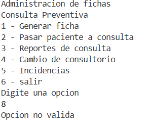

El programa volvera a mostrar el menu hasta ingresar una opcion valida

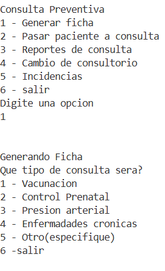
<h2>Caso 2:</h2>

Cuando nosotros ingresemos nuestros datos el programa hara un cuestionamiento sobre si la ficha es correcta en caso de no serlo nos ofrecera dos posibles opciones

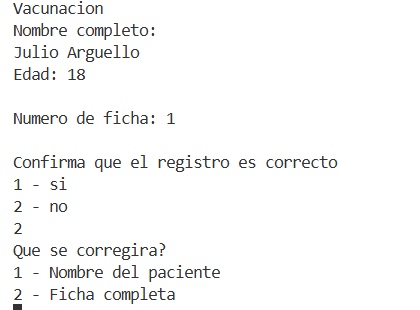

Podremos corregir la ficha o en su defecto corregir la ficha completamente este caso ocurre en el momento que se registra la ficha.

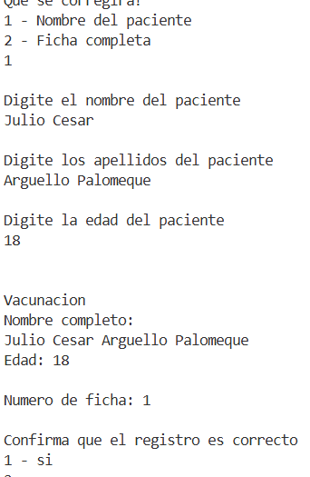

En este caso al corregir los datos de la ficha nos pide introducir nuevamente los datos de la ficha en caso de confirmar el registro el sistema que crea la nueva ficha oficialmente.

<h2>Caso 3:</h2>

Ahora en caso de que en vez de correcion de datos seleccionemos la opcion de ficha completa ocurre lo siguiente.

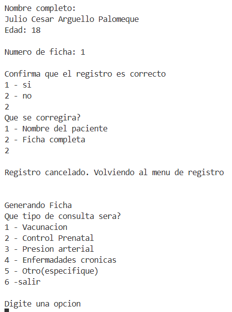

Al decir que cambiamos la ficha por completo el programo cancela la ficha que estabamos creando para devolvernos al menu de generacion de ficha para iniciar con el registro desde cero.

<h2>Caso 4:</h2>

En el caso 2 de pasar paciente a consulta se presenta un menu en el cual las listas para pasar pacientes se gestiona de manera separada es decir una lista por cada consultorio disponible. Cuando pasamos a un paciente a un consultorio el programa nos pregunta si los datos del paciente son correctos en caso de ser pasa lo siguiente.

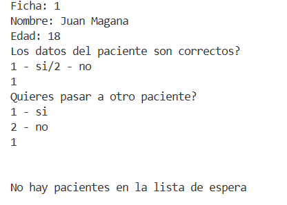

Al pasar al paciente nos pregunta si queremos pasar a otro en caso de decir que si comprueba que si haiga pacientes en lista de espera en caso de no haber imprime el mensade de “No hay pacientes en la lista de espera”

<h2>Caso 5:</h2>

Pasando a las incidencias estas pueden ocurrir desde que el paciente esta en lista de espera hasta antes de pasar a consulta.

En caso de que el paciente quiera corregir su ficha el sistema primero debe validar que la ficha exista. Si la ficha existe entonces se hara su debido cambio que en este caso sera de correcion de datos.

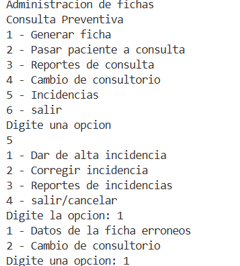
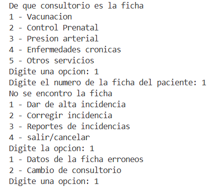
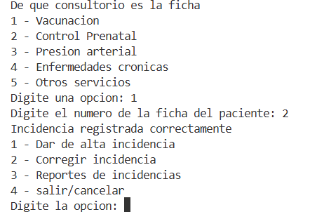

Una vez registrada la incidencia procedemos a corregirla

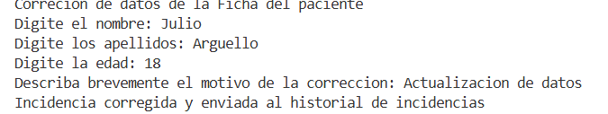

Si todo sale bien la incidencia se registra correctamente.

<h2>Caso 6:</h2>

Ahora si la incidencia es por cambio de consulta entonces primero registraremos la incidencia y despues nos vamos al apartado de corregir la incidencia.

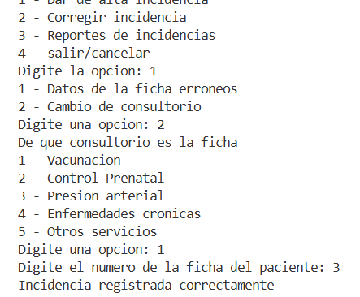

Cuando queramos corregir la incidencia primero nos pedira escribir el motivo de la incidencia y nos mostrara el siguiente mensaje.

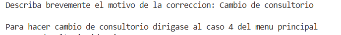

Nos pedira que nos movamos al caso 4 para hacer el moviemiento de consultorio.

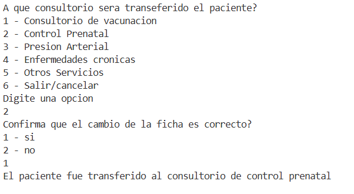

Una vez que se logre mover el paciente nos saldra el mensaje de confirmacion y para comprobar iremos al apartado de pasar paciente a consultorio e a consultorio y seleccionaremos el consultorio al cual lo transferimos.

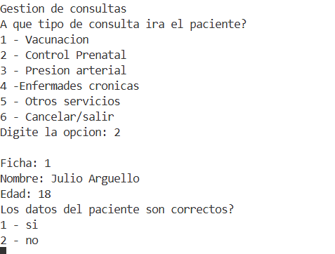

Como podemos notar el paciente fue transferido correctamente con un nuevo numero de ficha debido a que es nuevo consultorio con una lista diferente.

</body>
</html>
